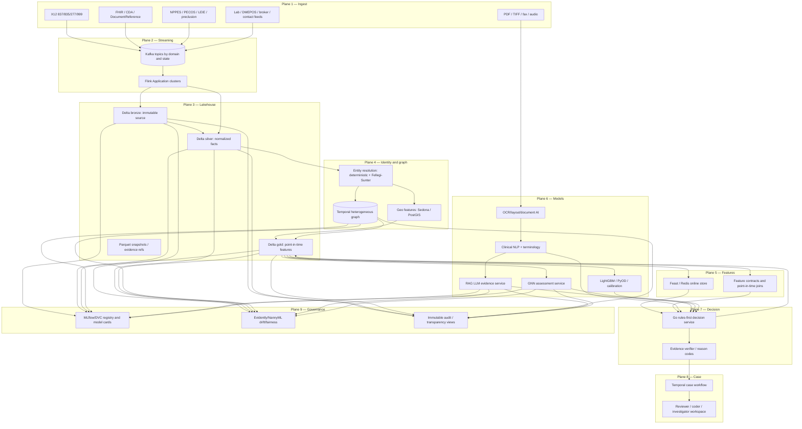

# CRUSH Healthcare Pipeline Design

## 1. Reference architecture

CRUSH implements the supplied nine-plane architecture as a healthcare program-integrity platform. The real-time path is event-driven, point-in-time, tenant/state partitioned, and evidence-producing. The decision service does not autonomously deny, suspend, revoke, exclude, or alter a beneficiary/provider status. It produces a recommendation and a case task governed by Temporal, with human and policy authorization for consequential actions.



## 2. Exact claims path

The claims path is a sequence of immutable events and materialized views. Kafka is the durable integration boundary. Every event has `tenant_id`, `programme_id`, `jurisdiction`, `event_id`, `occurred_at`, `ingested_at`, `source_system`, `schema_version`, `purpose_of_use`, `trace_id`, and a source-content hash. PHI/PII is represented by encrypted references or scoped tokens in shared event streams; raw payloads remain in the source-specific encrypted landing zone.

| Step | Component | Operation | Output |
|---:|---|---|---|
| 1 | Source adapters | Validate X12 envelopes, FHIR resources, documents, enrollment/list feeds, and contact records. Reject malformed or unauthorized data. | `SourceEnvelope.v1` |
| 2 | Kafka | Publish immutable, keyed events. Key claims by `tenant_id + jurisdiction + claim_id`; key entity events by stable tokenized entity ID. | `claim.received`, `enrollment.changed`, `list.updated`, `document.received` |
| 3 | Flink normalizers | Parse X12/FHIR, normalize code systems, deduplicate by source event ID, attach event-time/watermark, preserve raw lineage. | `ClaimEvent.v1`, `EnrollmentEvent.v1`, `DocumentReferenceEvent.v1` |
| 4 | Flink keyed state | Maintain bounded windows for provider/beneficiary/service-line velocity, duplicates, reversals, timely filing, ordering, place-of-service, and referral patterns. | `StreamingFeatureDelta.v1` |
| 5 | Entity resolver | Resolve provider, owner, beneficiary, lab, DMEPOS, broker, plan, and address entities using deterministic keys first, then probabilistic pair scoring. | `EntityLink.v1` with match score, evidence, resolver version, and abstention. |
| 6 | Graph builder | Append time-valid nodes/edges. Never overwrite raw identity assertions. Preserve `valid_from`, `valid_to`, source IDs, edge confidence, and resolver version. | `GraphDelta.v1`, graph snapshot ID |
| 7 | Sedona/Spark | Enrich service-area, distance, impossible-travel, provider-density, cross-border, and referral-geography features using versioned geometry. | `GeoFeature.v1` |
| 8 | Online feature materializer | Publish only approved online features to Feast/Redis with feature definition/version, event-time, freshness, and missing/stale flags. | `FraudFeatureSnapshot.v1` |
| 9 | Model services | Invoke LightGBM/PyOD and shadow GNN for bounded, calibrated advisory signals. Invoke LLM only for available evidence packs; no synchronous dependency on LLM availability. | `ModelAssessment.v1`, `EvidencePack.v1` |
| 10 | Go decision service | Run hard-stop data-quality/list/policy rules first; fuse advisory scores only according to versioned policy; create reason codes, evidence refs, and case tasks. | `DecisionRecord.v1` |
| 11 | Temporal | Enforce reviewer identity, statutory timers, notices, correction/appeal, and final disposition. | `CaseTask.v1`, `HumanDisposition.v1` |
| 12 | Governance | Store feature/model/prompt/retrieval versions, hashes, evidence spans, decisions, reviewer action, and outcome labels. | Reproducible audit and training label candidates |

The real-time decision response should use a bounded feature request with a fixed deadline. If Flink is stale, the GNN is unavailable, or the LLM evidence pack fails a gate, the system returns a typed degraded result and follows the approved rules-only or manual-review path. It must never interpret an AI timeout or abstention as a positive fraud finding.

## 3. Entity-resolution and graph design

The graph is a temporal, heterogeneous evidence graph, not a permanent accusation graph. Recommended node types are `Provider`, `Organization`, `Owner`, `ManagingEmployee`, `BeneficiaryToken`, `Lab`, `DMEPOSSupplier`, `Broker`, `Plan`, `Claim`, `ServiceLine`, `Document`, `Address`, `BankAccountToken`, and `ContactCampaign`. Recommended edge types include `OWNS`, `MANAGES`, `BILLS`, `ORDERS`, `REFERS_TO`, `SERVES`, `DELIVERS_TO`, `SHARES_ADDRESS`, `SHARES_CONTACT`, `APPEARS_ON`, `SUBMITS`, `ENROLLS_WITH`, and `CONTACTS`.

The resolver applies the following order:

1. Exact, authoritative identifiers such as NPI, taxonomy, state license, organization identifier, claim ID, or source-system key.
2. Normalized deterministic attributes such as phone, address, TIN token, domain, or document identifier where permitted.
3. Probabilistic Fellegi–Sunter features and a LightGBM pair classifier, trained only on reviewed match/non-match examples.
4. Human adjudication for low-confidence or consequential matches.

Each link contains positive and negative evidence, source records, comparison features, confidence, model/rule version, effective dates, and `abstain_reason`. A match score is not a finding of fraud. GNNs consume the graph only after the resolver’s uncertainty is represented as a feature and after point-in-time filtering.

The first GNN baselines should be relation-aware GraphSAGE/GAT-style message passing in PyTorch Geometric, with DGL as a challenger for distributed training. Candidate tasks are provider/claim risk ranking, suspicious-subgraph retrieval, link anomaly, and temporal component-change detection. Training uses temporal splits and label-availability cutoffs. The online service returns bounded top-k node/edge IDs, score intervals, snapshot/model/calibration versions, and abstention—not a natural-language allegation.

## 4. Clinical-document and LLM path

The supplied staged workflow becomes: ingest → split/classify → OCR/layout → coordinate-anchored text → legibility/completeness QC → PHI minimization → deterministic candidate generation → grounded adjudication → mandatory gates → human coder/clinical reviewer → evidence ledger and governed learning.

PaddleOCR or docTR emits page/line/word bounding boxes and table structure. MedSpaCy provides sentence, section, assertion, negation, and uncertainty processing; cTAKES is a second pipeline for concept, temporal, and relation extraction. The terminology layer resolves allowed ICD-10-CM, HCPCS/CPT, LOINC, SNOMED CT, RxNorm, MolDX, and local policy vocabulary versions. The LLM—Qwen3-8B or Mistral-7B-Instruct-v0.3 as a constrained baseline—receives only selected evidence spans and approved retrieved guidance.

The six mandatory gates are:

| Gate | Test | Failure behavior |
|---|---|---|
| G1 | Every assertion cites a source span or document coordinate. | Reject finding; route to review. |
| G2 | Proposed code/term belongs to the active approved vocabulary/version. | Reject candidate. |
| G3 | Every guideline/rule assertion cites an approved retrieval item and version. | Reject or abstain. |
| G4 | Classifier, primary LLM, or independent checker disagree. | Human review; never majority-vote an adverse action. |
| G5 | Confidence/calibration or documentation sufficiency is below threshold. | Emit `insufficient_documentation`/`abstain`. |
| G6 | Supported and missed/unsupported findings are reported symmetrically. | Add both directions to the evidence pack and reviewer queue. |

The LLM is asynchronous for pre-payment decisions. It drafts a structured evidence pack and reviewer explanation; it cannot create a provider revocation, beneficiary contact, claim denial, payment suspension, or payment/settlement command.

## 5. Delta Lake layout and retention

```text
s3://crush-lakehouse/
  bronze/{jurisdiction}/{domain}/ingest_date=YYYY-MM-DD/source_version=.../
  silver/{jurisdiction}/{domain}/event_date=YYYY-MM-DD/schema_version=.../
  gold/{jurisdiction}/features/as_of_date=YYYY-MM-DD/feature_set_version=.../
  graph/{jurisdiction}/snapshot_date=YYYY-MM-DD/graph_schema_version=.../
  evidence/{tenant}/{case_id}/evidence_pack_version=.../
  checkpoints/{job}/{tenant}/
  savepoints/{job}/{tenant}/
```

Bronze is append-only and source-identical with encryption and object lock. Silver normalizes but retains lineage and source hashes. Gold contains point-in-time features and no unrestricted raw narrative. Graph snapshots are immutable training inputs. Evidence packs include source-span references, retrieval IDs, OCR/layout versions, model/prompt versions, and reviewer actions. Retention and deletion are policy-controlled per data class, jurisdiction, and legal hold; a model artifact cannot extend clinical-data retention by default.

## 6. Spark, Flink, Ray, and DataFusion boundaries

| Framework | Owns | Must not own |
|---|---|---|
| Flink | Event-time normalization, deduplication, keyed windows, CEP, streaming aggregates, graph deltas, online materialization. | Model promotion, final case action, payment, unrestricted document generation. |
| Spark + Sedona | Heavy ETL, historical backfills, point-in-time feature generation, geometry joins, graph snapshot preparation, evaluation datasets. | Synchronous pre-payment decisions or mutable ledger state. |
| Ray | GNN/LLM training, distributed experiments, batch inference, backtests, hyperparameter search, embedding generation, shadow inference. | Source-of-truth claims, Temporal case state, final eligibility/action, financial command generation. |
| Delta Lake/Parquet | Versioned data products, snapshots, evidence references, checkpoint/savepoint locations. | Direct interactive access to raw PHI without governance. |
| DataFusion | Read-only tenant-approved Parquet analytics and investigator aggregates. | Mutations, unrestricted cross-tenant joins, operational decision authority. |

## References

[1]: https://www.federalregister.gov/documents/2026/02/27/2026-03968/request-for-information-rfi-related-to-comprehensive-regulations-to-uncover-suspicious-healthcare "CMS CRUSH RFI"
[2]: https://www.cms.gov/data-research/statistics-trends-and-reports/medicare-claims-synthetic-public-use-files "CMS SynPUFs"
[3]: https://github.com/medspacy/medspacy "MedSpaCy"
[4]: https://github.com/apache/ctakes "Apache cTAKES"
[5]: https://github.com/PaddlePaddle/PaddleOCR "PaddleOCR"
[6]: https://github.com/mindee/doctr "docTR"
[7]: https://huggingface.co/Qwen/Qwen3-8B "Qwen3-8B"
[8]: https://huggingface.co/mistralai/Mistral-7B-Instruct-v0.3 "Mistral-7B-Instruct-v0.3"
[9]: https://github.com/pyg-team/pytorch_geometric "PyTorch Geometric"
[10]: https://github.com/dmlc/dgl "DGL"
[11]: https://github.com/yzhao062/pyod "PyOD"
[12]: https://github.com/lightgbm-org/LightGBM "LightGBM"


## Diagram QA record

The generated nine-plane and claims-to-evidence Mermaid diagrams were rendered to PNG and visually inspected. The nine-plane diagram is legible at 3120 × 2100 pixels and shows the upward data/model flow with governance feedback paths. The sequence diagram is legible at 3120 × 800 pixels and shows the canonical event, Flink state, Delta Lake, entity graph, AI assessment, Go decision, Temporal review, and disposition path. The diagrams are available as editable `.mmd` sources under `deploy/diagrams/` and rendered PNGs under `reports/architecture/`.
