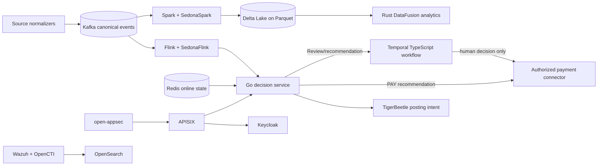

# CRUSH Integrity Platform — Implementation Profile

**Version:** 0.1.0  
**Status:** Initial executable foundation  
**Source requirements:** CRUSH Platform Spec Package v1.0, reconciled with the user-specified platform stack.

## 1. Delivery Boundary

This repository implements an **executable P0/P5 foundation and safety-critical vertical slice**, rather than representing a claim-adjudication replacement. The vertical slice accepts a canonical claim, applies deterministic eligibility and policy checks, produces an immutable and hash-linked `DecisionRecord`, creates a `CaseTask` for any recommendation that would withhold payment, and prepares auditable financial exposure postings. It never autonomously denies, suspends, revokes, settles, or pays a claim.

> **Safety invariant:** Only `PAY` may be emitted without human review. `DENY_RECOMMEND` and `SUSPEND_RECOMMEND` remain recommendations. A Temporal workflow requires an authenticated human approval before any final adverse case state can be projected.

| Delivery area | Implemented in this foundation | Deferred to a later workload |
|---|---|---|
| Canonical contracts | Versioned JSON Schema for claims, decisions, case tasks, and ledger postings; tenant and purpose-of-use fields are mandatory. | Avro registry integration and payer-specific X12/NCPDP grammar tables. |
| Synchronous decisioning | Go service with rule-first evaluation, reason codes, reproducibility fields, degraded-mode behavior, append-only hash chaining, Dapr publication, and idempotency boundary. | Production inference mesh, CQL, coverage policy authoring, and 450-ms performance qualification. |
| Case and due process | TypeScript Temporal workflow encodes legal transitions, statutory timers, and human approval. | Temporal cluster provisioning, UI, notices, evidence PDF renderer, and appeals UX. |
| Lakehouse and geospatial analytics | Python batch/stream jobs define Delta/Parquet bronze→silver→gold layout, Apache Spark and Sedona transformations, and Flink stream topology. | Connected S3/MinIO, Spark/Flink operators, production data agreements, and actual clinical/reference datasets. |
| Governed analytics | Rust DataFusion query service exposes read-only bounded analytic queries over approved Parquet extracts. | Delta-log writer integration, resource/cost benchmarking, and multi-tenant query scheduler. |
| Financial controls | A ledger intent contract plus TigerBeetle adapter boundary records exposure/reserve/release/reconciliation posting intent. | Running multi-replica TigerBeetle cluster and real payment-rail settlement credentials. |
| Security/platform | Kubernetes manifests, Dapr components, APISIX API boundary, Keycloak realm, NetworkPolicy, OpenSearch/Wazuh/OpenCTI integrations, open-appsec deployment values, and Kubecost allocation labels. | Certified FIPS modules, SPIFFE/SPIRE, OpenBao, policy-as-code enforcement, signed release artifacts, and formal authorization evidence. |

## 2. Technology Reconciliation

The original architecture specifies Apache Iceberg as its default lakehouse table format. This profile adopts **Delta Lake on Parquet** because it was explicitly required, while preserving the specification’s immutable snapshots, schema enforcement, batch/stream unification, and reproducibility goals. Delta Lake documents ACID transactions, schema enforcement, time travel, and connectors for Spark, Flink, and Trino. [1]

| Concern | Selected component | Role | Explicit boundary |
|---|---|---|---|
| Claim-event backbone | Kafka | Canonical tenant-scoped events, replay, durable `DecisionRecord` transport, and consumer decoupling. [2] | Only schema-compatible, idempotent events are decision-relevant. |
| Edge/secondary streams | Fluvio | Non-PHI edge telemetry, WASM transforms, and local developer event flows. [3] | It is not a second regulated event source of truth. |
| Stream state and CEP | Apache Flink + SedonaFlink | Exactly-once decision-relevant aggregates and spatial implausibility events. | Results are published back to Kafka after checkpoints. |
| Lakehouse | Delta Lake + Parquet + Spark + SedonaSpark | ACID tables, batch transforms, lineage-ready feature materialization, and spatial batch analytics. [1] [4] | Delta is canonical; no pooled cross-tenant PHI tables. |
| Low-latency analytics | Rust + Apache DataFusion | Read-only, Arrow-native query/API layer over approved Parquet/Delta-derived extracts. [5] | It is not the Delta transaction authority. |
| Distributed ML | Python + Ray | Isolated training, batch inference, model evaluation, and asynchronous serving. [6] | Models are accessed only through the inference gateway contract. |
| Online state | Redis | Short-lived online feature, list-status, and idempotency cache. [7] | Reconstructable cache; never an audit authority. |
| Operational system of record | Postgres | Per-tenant configuration, case projections, reason-code registry, and transactional outbox. | Immutable decisions and financial postings remain separate. |
| Financial-control ledger | TigerBeetle | Immutable debit/credit posting intent for dollars-at-risk, reserve, release, and reconciliation. [8] | It does not make payment, settlement, or adverse-action decisions. |
| Payment-network adapter | Mojaloop | Optional interoperable clearing/settlement integration after authorized external approval. [9] | Not in the pre-payment decision critical path. |
| Durable due process | Temporal + TypeScript | Long-running statutory clocks, state transitions, retry/replay, and human approval. [10] | Temporal is the only workflow-state authority. |
| Application runtime | Dapr | Portable service invocation, pub/sub, state, secret/configuration references, retries, and observability. [11] | It does not duplicate Temporal case ownership. |
| Public API edge | Apache APISIX | OIDC validation, mandatory headers, request limits, routing, schema checks, and trace propagation. [12] | East-west calls use Dapr/workload identity, not public APISIX routes. |
| Identity | Keycloak | OIDC issuer and tenant/role/purpose-of-use claim model. [13] | Tokens are validated at ingress and claims are checked in services. |
| Application security | open-appsec | WAF/API threat prevention before APISIX. [14] | Security telemetry contains no raw PHI. |
| Runtime security | Wazuh | Endpoint, container, configuration, vulnerability, and integrity telemetry. [15] | Alerts never influence claim outcomes automatically. |
| Threat intelligence | OpenCTI | Isolated management and correlation of cyber-threat intelligence. [16] | Only vetted indicators enter security controls; no clinical/claim content. |
| Search and observability | OpenSearch | Tenant-scoped metadata/search and audit/operational discovery. [17] | Raw PHI is rejected at ingestion. |
| Cluster and allocation | Kubernetes + Kubecost | Isolated deployment substrate and namespace/tenant cost allocation. [18] [19] | Production requires separately operated stateful data services. |

## 3. Service Ownership and Languages

| Deployment unit | Language | Owns | Consumes | Produces |
|---|---|---|---|---|
| `decision-service` | Go | Rule-first pre-payment recommendation; immutable decision construction; deterministic reason-code evaluation. | Canonical claim, list/feature response, policy configuration. | `DecisionRecord`, `CaseTask`, `LedgerPostingIntent`, telemetry. |
| `case-workflow` | TypeScript | Due-process workflow, case state machine, human action gating, statutory timers. | `CaseTask`, human approvals, appeal events. | `CaseEvent`, task projections, threshold-review trigger. |
| `lakehouse-jobs` | Python | Delta Lake ingestion/modeling, Spark/Sedona batch features, Flink/Sedona stream enrichments, Ray ML workloads. | Kafka canonical events, reference loads, geospatial boundaries. | Delta/Parquet silver-gold assets, feature events, geo findings. |
| `analytics-query` | Rust | Read-only Arrow/DataFusion analytics, bounded geospatial and reproducibility queries. | Approved Delta-derived Parquet extracts. | Query result sets and audit-safe metric responses. |
| `investigator-ui` | TypeScript | Future reviewer/investigator interface, Keycloak/OIDC integration, evidence browsing. | APISIX-protected service APIs. | Human disposition/approval inputs only. |

## 4. Data and Control Flow

1. A source normalizer publishes a schema-compatible `ClaimEvent` to `crush.<tenant>.claims.v1` in Kafka.
2. Flink/Sedona maintains rolling and geospatial aggregates, while Spark/Sedona materializes Delta/Parquet silver and gold assets.
3. The Go decision service validates the authenticated tenant and `purpose_of_use`, applies deterministic gates before scores, and records the exact policy, feature, and model version references.
4. A `PAY` result is emitted directly as a recommendation. Any non-payment recommendation produces a `CaseTask`, and the TypeScript Temporal workflow starts or signals the appropriate case.
5. The ledger adapter records only a posting **intent** (exposure, reserve, release, or reconciliation) with deterministic idempotency keys. TigerBeetle postings are never derived from a model score alone.
6. Human approval/rejection and appeal outcomes are the only inputs allowed to finalize an adverse case state. Those outcomes are emitted to Kafka, written to Delta, and fed to monitoring/fairness workflows.

## 5. Required Invariants

| ID | Invariant | Enforcement in the foundation |
|---|---|---|
| INV-001 | A tenant ID is derived from authentication, never trusted from an arbitrary body field. | APISIX and Keycloak claim mapping; service-level contract validation. |
| INV-002 | Every write requires `purpose_of_use` and an idempotency key. | API contract, APISIX route policy, and decision-service request validator. |
| INV-003 | Rules precede probability. | Go evaluator runs deterministic exclusion, deceased-beneficiary, timely-filing, and order-before-delivery gates first. |
| INV-004 | Model dependency failure cannot silently block payment. | Decision service emits rules-only output with `degraded=true` and a sampling/audit flag. |
| INV-005 | No final adverse action is automatic. | Temporal TypeScript workflow rejects invalid/final adverse states without a human principal and rationale. |
| INV-006 | Every decision is reproducible. | Versioned contract fields, decision hash chain, feature hash, model/rule version references, and immutable event streams. |
| INV-007 | Cross-tenant PHI does not pool. | Namespace/tenant labels, default-deny NetworkPolicy, tenant-partitioned paths, and absence of cross-tenant joins. |
| INV-008 | Financial posting does not imply settlement. | TigerBeetle interface accepts posting intents; Mojaloop adapter requires a separately authorized settlement command. |
| INV-009 | Geospatial signals are advisory and explainable. | Sedona metrics record calculation inputs, distance, geometry quality, and threshold; they cannot act alone. |
| INV-010 | Security findings are not healthcare integrity findings. | Wazuh/OpenCTI/open-appsec telemetry is isolated from patient/claim decision inputs. |

## 6. Initial Acceptance Criteria

The repository is accepted as a foundation when its local verification suite proves that deterministic hard stops and degraded decisions are reproducible, a recommended adverse action becomes a Temporal human-review task rather than a final action, geospatial distance features use a stable documented calculation, the DataFusion service is read-only and tenant-filtered, schemas reject missing tenant/purpose/idempotency fields, and Kubernetes manifests declare default-deny tenant network isolation.

## References

[1]: https://docs.delta.io/ "Delta Lake documentation"
[2]: https://kafka.apache.org/documentation/ "Apache Kafka documentation"
[3]: https://www.fluvio.io/ "Fluvio"
[4]: https://sedona.apache.org/latest/ "Apache Sedona documentation"
[5]: https://datafusion.apache.org/user-guide/introduction.html "Apache DataFusion documentation"
[6]: https://docs.ray.io/en/latest/ "Ray documentation"
[7]: https://redis.io/docs/latest/ "Redis documentation"
[8]: https://tigerbeetle.com/ "TigerBeetle"
[9]: https://github.com/mojaloop "Mojaloop GitHub organization"
[10]: https://docs.temporal.io/ "Temporal documentation"
[11]: https://docs.dapr.io/ "Dapr documentation"
[12]: https://apisix.apache.org/docs/apisix/ "Apache APISIX documentation"
[13]: https://www.keycloak.org/documentation "Keycloak documentation"
[14]: https://www.openappsec.io/ "open-appsec"
[15]: https://documentation.wazuh.com/current/ "Wazuh documentation"
[16]: https://docs.opencti.io/latest/ "OpenCTI documentation"
[17]: https://docs.opensearch.org/latest/ "OpenSearch documentation"
[18]: https://kubernetes.io/docs/home/ "Kubernetes documentation"
[19]: https://docs.kubecost.com/ "Kubecost documentation"
