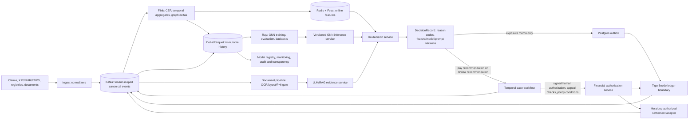

# CRUSH Real-Time AI Financial-Control Architecture and Kubernetes Sizing Guide

**Status:** Architecture recommendation for controlled integration, not an authorization to execute payment, suspension, denial, reserve hold, or settlement.

**Reference patterns applied:** The supplied nine-plane CRUSH reference architecture and the supplied evidence-gated coding-review workflow. The former establishes upward data flow with downward governance controls; the latter establishes a sequence of document understanding, deterministic candidate generation, grounded adjudication, mandatory hallucination-control gates, human disposition, and traceable learning. This guide applies both patterns to real-time fraud signals and financial boundaries.

## 1. Design Position

LLMs and graph neural networks (GNNs) are **evidence-producing analytical components**, not financial or administrative authorities. They may classify, prioritize, retrieve, summarize, and identify suspicious subgraphs; they may not create a final adverse action, make a settlement instruction, or choose a TigerBeetle transfer amount/account. The authoritative decision chain is deterministic policy → calibrated advisory signals → a `DecisionRecord` → a case workflow with human due process → a separately authorized financial command.

> **Control rule:** A model result may create or enrich a `CaseTask`; only an independently authorized, signed workflow outcome may authorize a financial-control posting or a Mojaloop settlement command.

This matches the existing CRUSH invariants: deterministic rules precede probability, degraded model behavior is rules-only rather than implicitly punitive, and TigerBeetle/Mojaloop are outside the pre-payment model critical path.

| Plane | Responsibility in this design | May create a payment/hold/denial? |
|---|---|---:|
| 1–5: Ingest, stream, lakehouse, graph, features | Normalize facts; compute versioned, tenant-scoped features and evidence. | No |
| 6: Models | Produce calibrated risk, candidates, citations, graph explanations, abstentions, and uncertainty. | No |
| 7: Decision | Apply non-negotiable deterministic controls; compose a recommendation and evidence. | No |
| 8: Case and action | Enforce clocks, reviewer separation, notice/appeal processes, and signed human approval. | Only after policy authorization |
| 9: Governance | Approve model/prompt versions, monitor drift and fairness, preserve audit records. | No |
| Financial boundary | Record authorized accounting facts in TigerBeetle; submit an already-authorized transfer through Mojaloop. | Yes, but never on model output alone |

## 2. End-to-End Real-Time Control Flow

The proposed real-time path uses Kafka as the durable source of integration events, Flink as the stateful feature/CEP engine, Go as the deterministic decision boundary, Temporal as the due-process authority, TigerBeetle as the immutable financial-control ledger, and Mojaloop only as an optional external-settlement adapter. Ray hosts training, batch scoring, and latency-tolerant inference services; it does not own event delivery, case state, or accounting state.



All arrows are tenant-scoped and carry a trace/correlation ID. No edge exists from the LLM, GNN, Flink score, or Go recommendation directly to TigerBeetle’s payment-control account or to Mojaloop’s transfer APIs.

## 3. Input Contracts and Provenance

Every message should use a versioned schema with `tenant_id`, `programme_id`, `purpose_of_use`, `event_id`, `occurred_at`, `source_system`, `schema_version`, `trace_id`, and a content hash. PHI belongs only in an encrypted, tenant-partitioned record reference; it is not copied to OpenSearch, Wazuh, OpenCTI, or generic model prompts.

| Event | Produced by | Required evidence fields | Consumer boundary |
|---|---|---|---|
| `ClaimEvent.v1` | Source normalizer | Source hash, claim lineage, service date, provider/beneficiary token IDs. | Flink and Go rule engine |
| `GraphDelta.v1` | Flink/entity-resolution plane | Edge type/time, confidence, resolver/version, source event IDs. | Graph materializer and GNN feature builder |
| `FraudFeatureSnapshot.v1` | Flink/Feast | Point-in-time feature vector, feature definitions/hash, watermarks, stale/missing flags. | Go decision service and model gateway |
| `GnnAssessment.v1` | GNN inference gateway | Model/data snapshot/calibration version, risk interval, abstention, top contributing subgraph IDs. | Go decision service only |
| `EvidencePack.v1` | Document/LLM evidence service | Source spans/bounding boxes, retrieval item IDs, citation checks, prompt/model/version, abstention. | Investigator workspace and Go decision record |
| `DecisionRecord.v1` | Go decision service | Rules fired, advisory inputs, decision hash, model/prompt policy references, provenance. | Temporal; audit; exposure-memo outbox |
| `HumanAuthorization.v1` | Temporal workflow | Reviewer principal, authority basis, reason, timestamp, case/appeal state, dual-control evidence when required. | Financial authorization service |
| `LedgerPostingCommand.v1` | Financial authorization service | Deterministic transfer ID, account pair, currency/amount, authorization ID, immutable decision reference. | TigerBeetle only |
| `AuthorizedSettlementCommand.v1` | Financial authorization service | Mojaloop participant/routing/quote references, authorization ID, transfer ID, retry key. | Mojaloop adapter only |

An event that lacks a valid tenant/purpose context, a proven schema version, an allowed data-use basis, or a traceable source must be rejected or routed to manual data-quality review. It must not be silently converted into a risk feature.

## 4. GNN Integration for Fraud-Ring Detection

### 4.1 What the GNN receives

The graph plane models time-bounded relationships among providers, owners, TINs, NPIs, beneficiaries, bank accounts, addresses, labs, referring clinicians, DMEPOS suppliers, plan/broker entities, claims, and normalized documents. Entity resolution provides confidence-scored edges; it must not overwrite raw identities. The GNN runs on a **point-in-time graph snapshot** that excludes post-decision facts, preventing future-label and outcome leakage.

Flink is responsible for online edge deltas, windows, velocity measures, and simple graph measures that have deterministic semantics. Ray is responsible for computationally expensive GNN training, backtesting, embedding generation, calibration, and model serving. The synchronous decision path reads a bounded subgraph/embedding from the inference gateway or an online feature cache; it does not issue an unbounded graph traversal.

| GNN output | Interpretation | Permitted use | Prohibited use |
|---|---|---|---|
| `ring_risk` with prediction interval | Calibrated advisory likelihood that a relevant local graph resembles confirmed typologies. | Review prioritization and score fusion. | Automatic payment denial, hold, suspension, or settlement. |
| `neighbor_contributions` | Top-k node/edge IDs and model explanation artifacts for the local ego graph. | Evidence-pack creation, investigator drill-down, model challenge/rebuttal. | Treating an explanation as independent proof. |
| `embedding_version` and `graph_snapshot_id` | Reproducibility anchors. | DecisionRecord and model registry metadata. | Omitting versioning because the score looks stable. |
| `abstain`, `stale`, or `data_quality_warning` | Model is unavailable, graph is incomplete, or uncertainty exceeds the policy threshold. | Trigger rules-only decision and optional review sampling. | Mapping abstention to elevated risk. |

### 4.2 Model topology

Use a layered design rather than a monolithic end-to-end GNN.

1. **Deterministic and statistical graph features:** Flink computes freshness, edge count, component growth, degree delta, community-change, referral velocity, cross-program reuse, and peer residual features. These are testable, explainable inputs and remain available when GNN serving is unavailable.
2. **Offline GNN development:** Ray trains temporal/heterogeneous GNN candidates—such as relation-aware GNNs for entity/claim edges and temporal graph models for migration/rewiring patterns—against a frozen Delta snapshot. Development includes leakage checks, protected-group review, calibration, robustness against entity-resolution uncertainty, and a held-out temporal test set.
3. **Model promotion:** The governance plane signs the model artifact, feature contract, graph schema version, calibration artifact, benchmark report, and approved intended-use policy. The deployed service accepts only the matching feature/schema version.
4. **Online assessment:** A tightly bounded model gateway obtains an entity’s current ego graph or pre-computed embedding, returns a typed `GnnAssessment`, and emits latency/abstention/staleness telemetry. A timeout returns `unavailable`; it does not increase risk.

### 4.3 Real-time graph response sequence

```mermaid
sequenceDiagram
  participant K as Kafka
  participant F as Flink graph/CEP
  participant M as GNN gateway
  participant G as Go decision service
  participant T as Temporal

  K->>F: ClaimEvent + graph deltas
  F->>F: Update tenant/window state; checkpoint
  F->>M: Bounded GraphFeatureRequest(snapshot/version)
  M-->>F: GnnAssessment or abstain/unavailable
  F->>G: FraudFeatureSnapshot + assessment reference
  G->>G: Run deterministic rules before risk fusion
  alt rule hard stop or GNN unavailable
    G->>T: CaseTask or rules-only recommendation
  else calibrated advisory risk
    G->>T: CaseTask with DecisionRecord/EvidencePack reference
  end
```

The GNN is intentionally downstream of Flink checkpoints and upstream only of a recommendation. This preserves replay: the feature snapshot, graph snapshot ID, model artifact, and calibration are preserved in the `DecisionRecord` and can be rerun during an appeal.

## 5. LLM and Document-AI Integration

### 5.1 Adapt the supplied evidence-gated pattern

The supplied coding-review diagram is a strong pattern for any clinical-document or medical-coding integrity signal. It should be implemented as a separate evidence-production route, not as an automatic coding/payment process.

| Supplied stage | CRUSH implementation | Output |
|---|---|---|
| Document understanding | Document splitting/classification; layout-aware parsing; page/line/bounding-box provenance; OCR/legibility review; PHI-minimization gate. | Normalized, tenant-scoped document evidence with coordinate anchors. |
| Candidate generation | Deterministic policy checks, PLM-ICD/MedCAT-style classifiers, terminology lookup, and negation/context rules. | High-recall candidate codes, diagnoses, documentation gaps, and factual assertions. |
| Grounded adjudication | Retrieve only approved, versioned policy/guideline content and permitted chart spans. Generate constrained structured output through a vetted open-weight LLM and an independent checker. | Citation-backed candidate finding or calibrated abstention. |
| Mandatory gates | Span verification, valid-vocabulary check, citation verification, model disagreement routing, calibrated abstention, symmetric missed/unsupported code review. | Valid `EvidencePack` or no recommendation. |
| Human disposition | Coder/clinician/investigator reviews source highlights, guideline citations, confidence, and alternatives. | Accepted/modified/rejected finding with reason. |
| Active learning | Only dispositioned, provenance-complete and policy-approved examples enter a governed training queue. | Curated, versioned training labels. |

The LLM receives the smallest possible context: de-identified/limited clinical text where valid, source-span identifiers, an approved retrieval set, and a structured task. It should not receive raw cross-tenant narratives or unrestricted web search results.

### 5.2 LLM outputs and runtime controls

Require a schema such as `EvidencePack.v1`; reject free-form output as an integration contract. The LLM may return `abstain` or `insufficient_documentation` as first-class outcomes. Every assertion must be tied to a source span and an approved retrieval citation. Model output lacking a source-span ID, a citation ID, a valid-code reference, or a known prompt/model policy version is discarded rather than sent to decisioning.

| Mandatory guardrail | Enforcement point | Failure result |
|---|---|---|
| Retrieval allowlist and tenant partition | RAG gateway and vector/index namespace | No retrieval or explicit abstention. |
| Structured output schema | Model gateway JSON-schema validation | Output rejected. |
| Chart-span/bounding-box verification | Evidence verifier | Finding rejected. |
| Guideline/policy citation verification | Retrieval/evidence verifier | Finding rejected. |
| Vocabulary/terminology check | Terminology service | Candidate rejected. |
| Dual-adjudicator disagreement gate | Policy orchestrator | Human review, never majority-vote adverse action. |
| Prompt/model/knowledge-base version capture | Gateway and DecisionRecord | Release blocked or output invalid. |
| Rate, token, and content budget | APISIX and LLM gateway | Fallback to deterministic/doc-review path. |

LLMs should be asynchronous with respect to the hard pre-payment latency path. When model-derived document evidence is not already available, the claim can proceed through deterministic policies and existing validated features, or be routed to a time-bounded human document review according to policy. An LLM timeout must not act as a fraud score.

## 6. TigerBeetle Integration: Financial-Control Ledger

TigerBeetle’s transfer and account IDs provide end-to-end idempotency; client-side generation/persistence of the ID before submission is the documented reliable-submission pattern. [1] In CRUSH, the “client” is the financial authorization service—not an LLM, GNN, Ray actor, Flink operator, or browser.

### 6.1 Three separate financial objects

| Object | Created by | Meaning | TigerBeetle call allowed? |
|---|---|---|---:|
| `LedgerPostingIntent` | Go decision service | A non-financial statement that evidence suggests an exposure estimate. No reserve, hold, or settlement effect. | No; publish to outbox for audit/review. |
| `LedgerPostingCommand` | Financial authorization service after signed policy/human authorization | Immutable instruction to record an allowed exposure/reserve/release/reconciliation accounting event. | Yes, after all checks pass. |
| `SettlementCommand` | Financial authorization service after applicable payment authorization | Instruction to an external payment network with participant, quote, amount, and authorization evidence. | TigerBeetle may record accounting effect; Mojaloop adapter is called separately. |

The Go decision service can create an **exposure memo intent** associated with the claim/case/decision. It cannot select a release/hold account pair or invoke the ledger. The financial authorization service recomputes the permitted account pair and monetary terms from authoritative claim/payment state and verifies all preconditions. This prevents score laundering: an AI score cannot become money movement by being serialized as an accounting request.

### 6.2 TigerBeetle command gate

A dedicated service—separate from the model gateway and the Go decision service—accepts a command only if all fields verify.

```text
required:
  signed HumanAuthorization or policy-authorized system event
  decision_record_hash and case_id
  tenant/programme/account authorization match
  deterministic transfer_id persisted before submit
  amount/currency/ledger code derived from authoritative payment state
  no active appeal/reversal/duplicate condition
  allowed posting type and double-entry account pair
  idempotency replay performs lookup, never mutation
```

The transfer ID should be derived deterministically from an immutable authorization aggregate, for example `H(tenant_id, authorization_id, posting_type, authoritative_claim_payment_version, account_pair, currency, amount_minor)`. Persist it before sending. A retry uses the same ID and treats an “exists” response as a reconciliation event, consistent with TigerBeetle’s reliable-submission semantics. [1]

The ledger service should emit `LedgerPosted`, `LedgerRejected`, and `LedgerReconciled` events. Those events can feed the graph/history plane as facts—under their own provenance and tenant boundary—but are not labels until an investigation and outcome process declares them fit for training.

## 7. Mojaloop Integration: Authorized Settlement Only

Mojaloop’s hub architecture includes API adapters for provider integration, central services for movement/central-ledger logic, account lookup, quoting, and Kafka-based inter-service messaging in the referenced implementation. [2] CRUSH should treat Mojaloop as an external interoperable-payment connector, not a fraud decision engine.

### 7.1 Placement in the architecture

The Mojaloop adapter sits behind the financial authorization service and uses an outbox/command-consumer design. It subscribes only to `AuthorizedSettlementCommand` events and never to raw model scores, `GnnAssessment`, `EvidencePack`, or `DecisionRecord` recommendations.

| Incoming condition | Mojaloop adapter action |
|---|---|
| High GNN/LLM advisory risk | None. The decision layer may create a case task. |
| Deterministic policy rule / review recommendation | None. A case may be initiated. |
| Human authorization recorded but appeal/notice window open | None or an explicit policy-defined waiting action. |
| Complete `AuthorizedSettlementCommand` and all financial checks pass | Resolve/validate routing, validate quote/limits, submit the idempotent network request, and emit the result. |
| Adapter/API timeout | Retry through the persisted outbox using the same command key; do not regenerate economic terms. |
| Duplicate request or callback | Reconcile by command/transfer IDs; emit an event but do not create a new settlement. |

### 7.2 Settlement preconditions

The financial authorization service must validate an authorization chain that includes the policy basis, human principal where required, approved amounts, participant/account data, and appeal status. For payment-hold scenarios, an explicit legal/program authorization must be distinguished from a GNN risk or LLM finding. The adapter should operate on synthetic/test participants until full control and reconciliation tests pass.

No “fraud score threshold” should be configured as a Mojaloop decision rule. The only model-related inputs visible at this boundary should be immutable references in the audit payload, so a future reviewer can understand why a case was initiated—not to determine whether settlement executes.

## 8. Failure Handling and Time Budgeting

Use separate error budgets for the real-time decision path and the evidence-enrichment path. Exact latency SLOs must be benchmarked with representative claim mix, Kafka partitioning, state size, and required policy deadlines; they must not be inferred from model benchmarks alone.

| Component failure | Safe degradation | Persisted evidence |
|---|---|---|
| Kafka/Flink feature lag or stale watermark | Mark feature stale; use approved last-known feature only if policy permits, otherwise route to data-quality/manual review. | Feature timestamp, watermark, lag, fallback reason. |
| GNN gateway timeout/unavailable | `abstain/unavailable`; run rules-only decision; optionally sample for review. | Model status and timeout. |
| LLM/RAG guardrail failure or timeout | No inferred finding; send to document-review queue if policy requires. | Failed gate and source/knowledge-base versions. |
| TigerBeetle unavailable | Do not retry from an AI process; retain authorized command in outbox, reconcile with same transfer ID. | Command ID, outbox state, retry count. |
| Mojaloop unavailable/callback delayed | Do not regenerate command; preserve immutable command and reconcile callback. | Network command/reference and callback state. |
| Temporal unavailable | Do not finalize a case/action. Hold state as pending workflow recovery. | Correlation/case ID and delivery outcome. |

## 9. Kubernetes Deployment Topology

Create clear workload classes, namespaces, service accounts, and node pools. Do not combine latency-sensitive Flink stateful workloads, GPU training, and externally exposed APIs in a common unrestricted node pool.

| Namespace/workload class | Core workloads | Node-pool characteristics | Scaling control |
|---|---|---|---|
| `crush-edge` | open-appsec, APISIX, Keycloak adapters | General CPU, multi-zone, no PHI storage. | HPA/KEDA on request/concurrency metrics. |
| `crush-stream-<tenant>` | Flink Application clusters and Kafka connectors | CPU/memory-optimized, fast local disk for state spill, persistent object-store checkpoint path. | Flink operator/autoscaler policy after checkpoint validation. |
| `crush-ai-cpu-<tenant>` | Ray CPU training, batch inference, embedding jobs | CPU/memory-optimized; spot/preemptible only for restart-safe, non-deadline batch jobs. | KubeRay autoscaler + Kubernetes node autoscaler. |
| `crush-ai-gpu-<tenant>` | Ray GPU fine-tuning, GNN training/inference where needed, controlled LLM workloads | Dedicated GPU nodes; GPU device plugin; taints/tolerations; encrypted local scratch. | Separate KubeRay worker group and GPU node autoscaler. |
| `crush-decision-<tenant>` | Go decision, model/evidence gateways, Temporal workers | Low-latency CPU; no GPU dependency; protected PDB/topology spread. | HPA on request/latency and queue metrics. |
| `crush-financial-<tenant>` | Financial authorization, TigerBeetle adapter, Mojaloop adapter | Isolated CPU pool; stricter egress policy; no model containers. | Fixed/minimum replicas; queues drive bounded consumers. |
| `crush-governance` | Model registry, evaluation, monitoring, transparency jobs | CPU/memory mixed; access-controlled object storage. | Scheduled Jobs/HPA as appropriate. |

Apply tenant labels and NetworkPolicies consistently. The financial namespace accepts traffic only from the Temporal-authorized financial service and its persisted-outbox consumer. It must reject traffic from Ray, Flink, notebook, LLM, GNN, and investigator UI workloads.

## 10. Ray Deployment Patterns and Starting Resource Profiles

KubeRay autoscaling has three distinct layers: Ray Serve actor/replica scaling, Ray worker-pod scaling, and Kubernetes node autoscaling. The Ray autoscaler uses logical resource requests from tasks/actors/placement groups rather than host utilization; Kubernetes node autoscaling must be configured separately. [3] The KubeRay autoscaler runs as a head-pod sidecar, and each worker group defines minimum/maximum replica bounds. [3]

### 10.1 Separate cluster types

| Ray object | Use in CRUSH | Availability/Security posture |
|---|---|---|
| `RayJob` + ephemeral `RayCluster` | Reproducible GNN/LLM training, backtests, feature backfills, evaluation, batch evidence processing. | One immutable data/model snapshot per job; `minReplicas: 0`; no access to financial services. |
| Long-lived CPU `RayCluster` / Ray Serve | Bounded CPU embedding/scoring, lightweight document preprocessing, model shadow evaluation. | Separate from GPU and financial namespaces; scale to zero only if no real-time dependency. |
| Dedicated GPU `RayCluster` / Ray Serve | GPU GNN training/inference and LLM inference where a self-hosted model is approved. | Dedicated GPUs, strict node selection, no co-scheduled general workloads, object-store spill encrypted. |

Do not deploy both online scoring and long-running retraining on one Ray cluster. A training workload can exhaust the object store, CPUs, GPU memory, or network and degrade a service that participates in pre-payment review.

### 10.2 Starting—not final—Ray sizing profiles

These are conservative **initial deployment profiles**, not capacity commitments. They must be adjusted through replay-based load tests and workload telemetry. The model size, context length, graph neighborhood size, batch size, data skew, and SLO determine final sizing.

| Profile | Head pod request/limit | Worker group | Initial replicas / autoscaling bound | Suitable workload | Sizing trigger |
|---|---|---|---|---|---|
| Development / integration | 2 vCPU, 8 GiB | CPU: 4 vCPU, 16 GiB | 0–2 | Unit-scale GNN feature build, test inference, synthetic document pipeline. | Developer demand only. |
| Pilot CPU batch | 2 vCPU, 8 GiB | CPU: 8 vCPU, 32 GiB | 0–10 | Entity-resolution post-processing, graph materialization, backtesting, classical ML. | Pending Ray logical CPU/memory bundles plus job queue age. |
| Pilot GPU training | 2 vCPU, 8 GiB, no GPU scheduling | GPU: 1 GPU, 8 vCPU, 64 GiB | 0–4 | GNN training, approved LLM fine-tuning/evaluation, GPU batch inference. | Pending `GPU: 1` bundles; GPU memory/throughput benchmark. |
| Production online CPU | 4 vCPU, 16 GiB | CPU: 4 vCPU, 16–32 GiB | 2–12 | GNN embedding lookup/scoring and controlled CPU evidence functions. | p95/p99 queue delay, replica concurrency, object-store pressure. |
| Production online GPU | 4 vCPU, 16 GiB, no GPU scheduling | GPU: 1 GPU, 8–16 vCPU, 64–128 GiB | 1–N after benchmark | Low-latency GNN/approved LLM inference, not long training. | Tail latency, GPU memory, token/graph batch saturation, error/abstention rate. |

For GPU workloads, KubeRay requires `nvidia.com/gpu` in Ray container resource requests/limits. It advertises those limits to the Ray scheduler/autoscaler; worker groups can be selected using node labels and GPU node tolerations. [4] CPU-only pods scheduled to GPU nodes should set `NVIDIA_VISIBLE_DEVICES=void` to avoid unintended device visibility, a caveat called out in Ray’s Kubernetes GPU guide. [4]

### 10.3 Ray manifest pattern

```yaml
apiVersion: ray.io/v1
kind: RayCluster
metadata:
  name: crush-gnn-training
  namespace: crush-ai-gpu-tenant-a
spec:
  enableInTreeAutoscaling: true
  autoscalerOptions:
    version: v2
    idleTimeoutSeconds: 300
    upscalingMode: Conservative
    resources:
      requests: {cpu: "500m", memory: "512Mi"}
      limits: {cpu: "500m", memory: "512Mi"}
  headGroupSpec:
    rayStartParams: {num-cpus: "0"}
    template:
      spec:
        serviceAccountName: crush-ray-ai
        containers:
          - name: ray-head
            image: registry.example/crush-ray-ml@sha256:REPLACE
            resources:
              requests: {cpu: "2", memory: "8Gi"}
              limits: {cpu: "2", memory: "8Gi"}
  workerGroupSpecs:
    - groupName: gpu-train
      replicas: 0
      minReplicas: 0
      maxReplicas: 4
      rayStartParams: {num-gpus: "1", num-cpus: "8"}
      template:
        spec:
          restartPolicy: Never
          nodeSelector: {workload.crush.io/gpu: "true"}
          tolerations:
            - key: nvidia.com/gpu
              operator: Exists
              effect: NoSchedule
          containers:
            - name: ray-worker
              image: registry.example/crush-ray-ml@sha256:REPLACE
              resources:
                requests: {cpu: "8", memory: "64Gi", nvidia.com/gpu: "1"}
                limits: {cpu: "8", memory: "64Gi", nvidia.com/gpu: "1"}
```

The `500m` CPU/`512Mi` autoscaler sidecar allocation follows the KubeRay documented default. [3] Replace images, node labels, and resource values only after a controlled benchmark. The head schedules no workload (`num-cpus: "0"`) to isolate cluster control. `restartPolicy: Never` is required for worker management when using KubeRay autoscaling. [3]

### 10.4 Ray resource-sizing method

For each model route, measure rather than guess:

```text
required worker replicas ≥ ceil(concurrent logical resource demand / usable resources per worker)
GPU workers ≥ ceil(required concurrent GPU actors / GPUs exposed per worker)
CPU workers ≥ ceil(max(concurrent CPU demand / worker CPUs,
                       object-store demand / usable worker memory,
                       data-loader/network demand / measured worker throughput))
```

Reserve capacity outside Ray for the operating system, kubelet, CNI, log/telemetry agents, and GPU device plugin. Do not configure Ray logical CPUs or GPUs higher than Kubernetes resource limits; KubeRay/Ray scheduling assumes those values reflect real capacity. [3] [4]

## 11. Flink Deployment Patterns and Starting Resource Profiles

Use the Flink Kubernetes Operator and **Application Mode** for production CRUSH streams. Flink documentation recommends Application Mode for better application isolation and specifies that application code should be packaged with the image or managed as an artifact. [5] Run a separate application cluster per tenant-domain/job class—for example, claim deduplication, pre-payment feature aggregation, graph delta generation, or document-event orchestration—rather than a multi-tenant session cluster.

Flink’s JobManager coordinates scheduling, checkpoints, and recovery. TaskManagers execute tasks. Task slots partition managed memory but do not provide CPU isolation; smaller TaskManagers with one slot provide stronger task isolation, whereas multiple slots increase JVM/resource efficiency. [6]

### 11.1 Starting Flink profiles

These profiles are **initial baselines** to be validated through a replay of representative synthetic/institution-approved events. Configure exactly one total-memory mode per Flink process: preferably `jobmanager.memory.process.size` and `taskmanager.memory.process.size` for Kubernetes containers. Flink cautions that configuring both total process memory and total Flink memory can conflict. [7]

| Profile | JobManager process | TaskManager process and slots | Initial TM replicas | Job types | Primary scale signal |
|---|---|---|---:|---|---|
| Development / correctness | 1 vCPU, 2 GiB | 1 vCPU, 4 GiB, 1 slot | 2 | Schema validation, short CEP/dedup test streams. | Backlog, checkpoint completion. |
| Pilot low-latency feature stream | 2 vCPU, 4 GiB | 2 vCPU, 8 GiB, 1 slot | 3 | Per-provider windows, list propagation, temporal graph deltas, Sedona distance features. | Sustained source lag, p95 end-to-end latency, busy time, checkpoint duration. |
| Pilot state-heavy feature stream | 2 vCPU, 4 GiB | 4 vCPU, 16 GiB, 1 slot | 3–6 | High-cardinality keys, long windows, CEP, dedup, large keyed state. | State growth, RocksDB/ForSt spill, checkpoint size/duration, backpressure. |
| Production isolated stream | 2–4 vCPU, 4–8 GiB | 4 vCPU, 16–32 GiB, 1 slot | Determined by partitions and measured state | Dedicated claims, graph-delta, or settlement-reconciliation job. | Parallelism/partition alignment, p99 policy latency, recovery SLA. |

The 1-slot starting posture intentionally favors isolation for policy-critical jobs. Flink documents that task slots define managed-memory partitions but do not isolate CPU, so a 1-slot TaskManager is a prudent first configuration when an overloaded operator must not contend with a different critical pipeline. [6]

### 11.2 Flink operator pattern

```yaml
apiVersion: flink.apache.org/v1beta1
kind: FlinkDeployment
metadata:
  name: crush-tenant-a-prepay-features
  namespace: crush-stream-tenant-a
spec:
  image: registry.example/crush-flink-sedona@sha256:REPLACE
  flinkVersion: v2_3
  serviceAccount: crush-flink
  flinkConfiguration:
    kubernetes.cluster-id: crush-tenant-a-prepay-features
    taskmanager.numberOfTaskSlots: "1"
    parallelism.default: "3"
    jobmanager.memory.process.size: "4096m"
    taskmanager.memory.process.size: "8192m"
    state.backend.type: rocksdb
    execution.checkpointing.interval: "30 s"
    execution.checkpointing.timeout: "5 min"
    execution.checkpointing.mode: EXACTLY_ONCE
    execution.checkpointing.dir: s3://crush-checkpoints/tenant-a/prepay-features
    execution.checkpointing.savepoint-dir: s3://crush-savepoints/tenant-a/prepay-features
    kubernetes.rest-service.exposed.type: ClusterIP
  jobManager:
    resource:
      cpu: 2
      memory: "4g"
  taskManager:
    resource:
      cpu: 2
      memory: "8g"
  job:
    jarURI: local:///opt/flink/usrlib/crush-prepay-features.jar
    parallelism: 3
    upgradeMode: savepoint
```

Use `ClusterIP` for Flink’s REST/UI endpoint and access it with a temporary authenticated port-forward; Flink warns that externally exposing its REST endpoint can expose a path for code execution. [5] Restrict `FlinkDeployment` modification to the delivery/operator service account; an investigator or model user must not be able to submit arbitrary jobs into the production stream namespace.

### 11.3 Flink sizing method

Set Kafka partition count and key distribution first. The initial parallelism should generally not exceed the available partitions for a single Kafka source topic, while the total available task slots must meet the job’s highest required parallelism under slot sharing. [6] Then use the following repeatable method:

1. Replay a representative event mix that includes key skew, late events, duplicate delivery, and peak bursts.
2. Measure records in/out, Kafka lag, watermark delay, busy time, backpressure, CPU throttling, heap/direct/managed memory, state size, checkpoint duration, and checkpoint alignment.
3. Increase parallelism and TaskManager replicas when the stream has sustained lag/backpressure or violates the approved latency SLO—not merely because CPU briefly spikes.
4. Increase TaskManager process memory or adjust state/backend parameters when state/checkpoint/recovery behavior is the constraint; do not simultaneously override overlapping Flink total-memory modes. [7]
5. Validate a savepoint restore and a single TaskManager failure before promoting changes. A “healthy” stream that has never restored from state is not production-ready.

## 12. Multi-Plane Security, Isolation, and Governance

The architecture must preserve the reference diagram’s downward governance controls.

| Control | Ray | Flink | LLM/GNN | TigerBeetle/Mojaloop |
|---|---|---|---|---|
| Identity | Dedicated service account, workload identity, tenant namespace. | Dedicated operator/job service account and Kafka ACL. | Gateway authenticates caller; no direct public model port. | Separate financial service account, mTLS, narrow egress. |
| Data minimization | Snapshot/feature references; no unrestricted PHI mount. | Tokenized event values; raw evidence references. | Minimum-context prompts, tenant retrieval partition, redacted logs. | No prompts/model scores accepted as financial command fields. |
| Network isolation | Deny egress to financial namespace. | Deny access to Mojaloop/TigerBeetle; allow Kafka/object store only. | Gateway-only access; evidence objects, not database superuser. | Allow only required ledger/network endpoints. |
| Audit | Model/data/artifact version; Ray job ID. | Job image/config/checkpoint/savepoint ID. | Prompt, model, retrieval, citations, gate outcomes. | Authorization ID, command/transfer ID, callback/reconciliation state. |
| Promotion | Governed Ray job evaluation. | Savepoint-backed roll forward/back. | Policy/prompt/model review and adversarial tests. | Human/policy authority independent of model promotion. |

OpenTelemetry traces should traverse claim ingestion, Flink feature event, model/evidence call, Go decision, Temporal case, financial authorization, TigerBeetle posting, and Mojaloop callback. Store tenant-safe metadata only in shared observability. Wazuh/OpenCTI security indicators remain isolated from healthcare integrity inputs unless a separately approved control process defines a non-PHI, auditable correlation rule.

## 13. Delivery Sequence

| Phase | Deliverable | Gate to advance |
|---:|---|---|
| 1 | Synthetic-only Kafka → Flink → Go → Temporal path with rules-only decisioning. | Replay, idempotency, CNI/network policies, state restore, and decision hash tests pass. |
| 2 | Entity resolution and deterministic graph features; no GNN in decision fusion. | Point-in-time feature tests and investigator evidence drill-down pass. |
| 3 | Offline Ray GNN training and backtesting on frozen snapshots; shadow-only online inference. | Calibration, leakage, fairness, drift, and explanation review accepted. |
| 4 | Evidence-gated document/LLM pipeline with source spans and mandatory abstention. | Citation/span/vocabulary/disagreement gates and human-review UX pass. |
| 5 | Case workflow authority and financial authorization service. | Human approval, appeal, dual-control, and authorization-chain tests pass. |
| 6 | TigerBeetle test ledger with immutable retry/reconciliation tests. | No model-originated command is accepted; transfer IDs remain stable on replay. |
| 7 | Mojaloop sandbox/test participants. | Outbox replay, duplicate callback, quote/routing, and reconciliation tests pass. |
| 8 | Controlled production rollout with shadow/champion models and observability. | Load, failure, recovery, security, data-minimization, and governance gates pass. |

## 14. Decisions to Make Before Final Sizing

Final resource requests cannot responsibly be fixed from architecture alone. Obtain the following measured inputs per tenant/programme before selecting production node counts or GPU types.

| Input | Why it controls sizing |
|---|---|
| Peak/steady event rate, burst factor, payload size, and Kafka partitions | Determines Flink parallelism, network buffers, and consumer scale. |
| Cardinality of provider/beneficiary/entity keys and window retention | Determines Flink state growth, checkpoint size, and recovery time. |
| Graph nodes/edges, neighborhood sampler, feature dimensions, and batch size | Determines GNN CPU/GPU memory and training/inference throughput. |
| LLM parameter count, quantization, context length, concurrency, and retrieval corpus size | Determines GPU memory, token throughput, vector/index capacity, and request queueing. |
| Required decision and evidence SLA; queue-age limits | Determines whether a route must be online, async, or human-queue based. |
| Data residency, tenant isolation, and HA/DR RTO/RPO | Determines namespace/pool segmentation, replica minimums, checkpoint/storage and regional design. |
| Approved model error/abstention and human-review capacity | Determines safe thresholds and prevents capacity pressure from changing risk policy. |

## References

[1]: https://docs.tigerbeetle.com/coding/reliable-transaction-submission/ "TigerBeetle — Reliable Transaction Submission"
[2]: https://docs.mojaloop.io/legacy/mojaloop-technical-overview/overview/ "Mojaloop Hub Overview"
[3]: https://docs.ray.io/en/latest/cluster/kubernetes/user-guides/configuring-autoscaling.html "KubeRay Autoscaling"
[4]: https://docs.ray.io/en/latest/cluster/kubernetes/user-guides/gpu.html "KubeRay GPU Usage"
[5]: https://nightlies.apache.org/flink/flink-docs-stable/docs/deployment/resource-providers/native_kubernetes/ "Apache Flink Native Kubernetes"
[6]: https://nightlies.apache.org/flink/flink-docs-stable/docs/concepts/flink-architecture/ "Apache Flink Architecture"
[7]: https://nightlies.apache.org/flink/flink-docs-stable/docs/deployment/memory/mem_setup/ "Apache Flink Process Memory"
