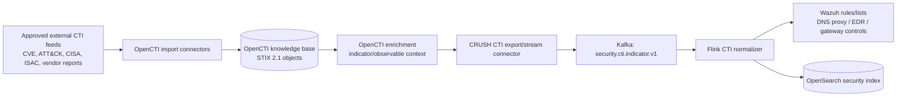
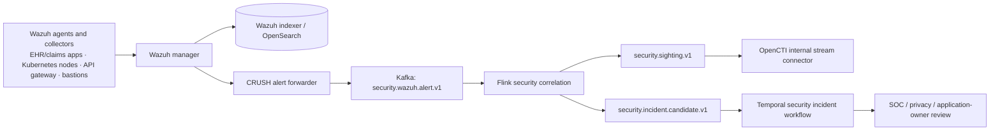

# CRUSH OpenCTI and Wazuh Healthcare Threat-Intelligence Pipeline

**Author:** Manus AI  
**Status:** Reference architecture and integration contract. This design detects and investigates cybersecurity activity; it does not make beneficiary, provider, clinical, enrollment, or payment decisions.

## 1. Objective and security boundary

CRUSH separates **healthcare program-integrity analytics** from **cybersecurity threat detection**. Wazuh observes endpoint, workload, Kubernetes, identity, application, file-integrity, vulnerability, and audit events. OpenCTI manages external cyber-threat intelligence and sanitized internal sightings using STIX 2.1. A security finding can create a security incident or restrict a technical integration account under approved incident-response policy. It must not create an allegation about a provider, beneficiary, clinician, or healthcare claim.

OpenCTI classifies connectors as import, enrichment, stream, import-file, or export-file. Import and enrichment connectors turn data into STIX 2.1 bundles; stream connectors consume platform events continuously for downstream SIEM/XDR/EDR-style systems. OpenCTI recommends a unique connector token for each deployed connector. [1] Wazuh File Integrity Monitoring observes creates, modifications, deletes, checksum/attribute changes, permission changes, and the responsible process or user when configured. [2]

## 2. Pipeline A — external intelligence to detection controls

The external feed pipeline performs the following operations in order.

| Step | Component | Input | Output and control |
|---:|---|---|---|
| 1 | OpenCTI import connector | Approved feed data only, with source, confidence, validity period, and license metadata. | STIX `indicator`, `observable`, `malware`, `attack-pattern`, `vulnerability`, and report objects where available. |
| 2 | OpenCTI enrichment connector | New/changed observable or vulnerability object. | Contextual STIX relationship bundle, preserving source and confidence. No PHI is accepted. |
| 3 | CRUSH CTI exporter | OpenCTI live stream filtered to active, approved-use indicators. | `security.cti.indicator.v1` Kafka event with STIX ID, observable type/value hash, valid-from/to, score/confidence, labels, ATT&CK references, and feed provenance. |
| 4 | Flink CTI normalizer | CTI indicator stream. | Versioned indicator lists for Wazuh/edge/EDR correlation, with TTL removal and out-of-order event handling. |
| 5 | Wazuh rule/list distribution | Sanitized, active indicators only. | Atomic versioned rule/list release. Rule bundle is signed, tested, and rollback-capable. |

OpenCTI itself is the intelligence and context plane; it is not a high-rate packet collector or a repository for patient records. The export connector must hash or tokenize values where raw transfer is unnecessary and must never include clinical documents, claim records, patient names, beneficiary tokens, or unredacted EHR audit content.

## 3. Pipeline B — Wazuh telemetry to cybersecurity incident detection

The CRUSH alert forwarder consumes Wazuh alerts from an authenticated, least-privilege export surface and normalizes them before Kafka publication. The forwarder writes to a security-only namespace and index. It performs data minimization before emission: user identifiers become HMAC tokens scoped to the security tenant; host IDs, Kubernetes workload identities, source IPs, destination IPs/domains, file hashes, process image hashes, HTTP route class, byte counters, and alert-rule IDs are retained. Complete patient identifiers, claims, clinical note contents, payload bodies, query strings, and filenames containing patient identifiers are excluded or replaced with opaque vault references.

| Wazuh source | Detection purpose | Required normalized fields | Escalation condition |
|---|---|---|---|
| FIM | Mass reads/archives or permission changes in EHR export, claims, SFTP, object-store client, and secret/config paths. | `agent_id`, `asset_class`, `path_class`, `action`, `hash_before/after`, `user_token`, `process_hash`, `event_time`. | Sensitive path modification, rapid enumeration/archiving, or access-control weakening. |
| Audit / syscall / command | Bulk export utility execution, archive/encryption tools, shell redirection, cloud CLI, suspicious child processes. | `process_hash`, `parent_hash`, `command_class`, `user_token`, `container_id`, `namespace`, `event_time`. | Unapproved export tool or action chain on a sensitive workload. |
| Application/API gateway logs | High-volume record export, abnormal GraphQL/FHIR search/page patterns, token misuse, errors around data-extract endpoints. | `principal_token`, `client_app`, `route_class`, `records_returned`, `bytes_out`, `response_status`, `request_rate`. | Volume/rate deviation, unusual data scope, or privileged route access. |
| Kubernetes audit / runtime | Secret reads, exec into pods, privileged workload changes, service-account use, anomalous egress. | `service_account`, `verb`, `resource`, `namespace`, `pod`, `destination_class`, `bytes_out`. | Sensitive secret access, container exec, or unexpected egress from PHI zones. |
| Network/DNS/proxy | Command-and-control, anomalous destinations, bulk encrypted outbound transfer. | `source_asset`, `destination_hash`, `destination_category`, `bytes_out`, `flow_duration`, `tls_fingerprint`. | CTI match or learned deviation plus sensitive-data path/API evidence. |
| Vulnerability / configuration | Exploitable assets and security-control drift. | `asset_id`, `cve`, `severity`, `exposure`, `configuration_rule`, `state`. | Critical exploitable exposure in externally reachable healthcare service. |

## 4. Pipeline C — Flink breach and exfiltration correlations

Flink consumes `security.wazuh.alert.v1`, `security.cti.indicator.v1`, API/gateway aggregates, Kubernetes audit events, and egress-flow summaries. It retains keyed state using a security incident key: `security_tenant | principal_token | workload_or_host | 24h incident window`. Security correlation is independent of the claims CEP stream and runs in a separate Kafka namespace, Flink deployment, Delta location, and OpenSearch index.

| Pattern ID | Event-time pattern | Detection condition | Candidate incident evidence |
|---|---|---|---|
| SEC-01 | `FIM sensitive-path change` → `process execution` within 15 minutes | New/changed export script, credentials, access policy, or archive in restricted path. | FIM checksum/permission diff, process lineage hash, asset identity, change ticket status. |
| SEC-02 | `privileged login or pod exec` → `secret read` → `egress anomaly` within 30 minutes | Privileged technical session accesses secret material followed by unusual outbound volume/destination. | Auth event, Kubernetes audit event, opaque secret reference, flow summary, destination CTI context. |
| SEC-03 | `API export rate anomaly` + `byte volume anomaly` + `new client/device` in 1 hour | API access pattern deviates from principal/service baseline and crosses approved export threshold. | Aggregated route class, request count, record-count buckets, bytes-out, consent/purpose-of-use state. |
| SEC-04 | `CTI indicator hit` + `sensitive workload` | Active, permitted CTI observable match on a workload classified as healthcare sensitive. | STIX indicator ID/version, Wazuh alert ID, source/destination hashes, workload classification. |
| SEC-05 | `ransomware-like file changes` + `backup-access changes` | High-rate file modifications/renames and backup/config modifications. | FIM event aggregate, user/process token, baseline deviation, backup-control alert. |
| SEC-06 | `service account anomaly` + `new destination` + `large encrypted transfer` | Workload identity makes unusual calls, then egresses beyond an approved destination/volume baseline. | Service account, namespace, destination category/hash, byte bucket, policy baseline version. |

Each pattern output is `security.incident.candidate.v1`, which contains only security evidence references, severity/calibration band, pattern ID, detection timestamp, data-handling classification, and a `requires_human_triage=true` flag. The system may trigger containment **only** through a separate, pre-approved incident-response playbook based on validated technical observables; it cannot automatically change healthcare eligibility, claim disposition, or payment state.

## 5. Pipeline D — sanitized internal sightings back to OpenCTI

A dedicated OpenCTI stream/import connector receives `security.sighting.v1` from Flink after privacy filtering and analyst approval. It creates STIX `sighting` objects that associate an approved indicator or observable with a pseudonymous internal asset class, time window, confidence, and incident reference. Do not send PHI, patient data, complete employee identities, raw packet payloads, complete URLs/query strings, or full forensic paths. The connector uses a dedicated token, connector identity, network policy, and write-only scope appropriate to its object type. [1]

This feedback improves CTI confidence and connects investigations across tools. It does not make OpenCTI the system of record for incident evidence: full raw Wazuh/API/Kubernetes events remain in the security-restricted OpenSearch/Delta evidence zone with access controls, retention policy, and legal-hold procedures.

## 6. Kubernetes deployment and access pattern

| Workload | Namespace | Identity and network boundary | Storage and retention |
|---|---|---|---|
| Wazuh agents | Healthcare workloads / nodes | Host/daemonset privileges are restricted to the security agent; no application business role. | Agent buffers only; manager is authoritative for alerts. |
| Wazuh manager/indexer | `security-observability` | Inbound from agents; outbound only to approved alert forwarder and OpenSearch dependencies. | Security logs, separately encrypted/indexed from PHI. |
| OpenCTI + connectors | `threat-intelligence` | One Keycloak/service identity and token per connector; CTI egress allowlist. | CTI STIX objects; no raw PHI/claims corpus. |
| Alert forwarder/Flink correlator | `security-analytics` | Read Wazuh export, write security Kafka/Delta/OpenSearch, no access to claims/clinical namespaces. | Sanitized telemetry and candidate incident evidence. |
| Temporal incident worker | `security-case` | Receives only candidate incident IDs/evidence refs, not raw data by default. | Human triage, containment approvals, audit. |

OpenSearch supports security investigation and Wazuh alert search. OpenCTI serves as CTI context/relationship management. DataFusion may expose only approved aggregate security indicators to authorized investigators. Wazuh and OpenCTI telemetry must not be joined with claims or clinical data outside a documented security investigation purpose and access grant.

## 7. Test and operational requirements

The integration must test CTI feed expiration, STIX schema validation, duplicate indicator handling, Wazuh alert normalization, privacy redaction, rule rollback, late/out-of-order events, malformed enrichment response, OpenCTI connector outage, Kafka replay, and incident-workflow evidence access. Monitor collector gaps, Wazuh alert delay, Kafka lag, Flink checkpoint success, correlation rate, false-positive triage rate, OpenCTI connector failures, sensitive-field redaction failures, and security-case time-to-triage.

## References

[1]: https://docs.opencti.io/latest/deployment/connectors/ "OpenCTI Connectors documentation"
[2]: https://documentation.wazuh.com/current/user-manual/capabilities/file-integrity/index.html "Wazuh File Integrity Monitoring documentation"
[3]: https://nightlies.apache.org/flink/flink-docs-stable/docs/ops/metrics/ "Apache Flink Metrics documentation"
[4]: https://nightlies.apache.org/flink/flink-docs-stable/docs/ops/monitoring/back_pressure/ "Apache Flink Back Pressure Monitoring documentation"
